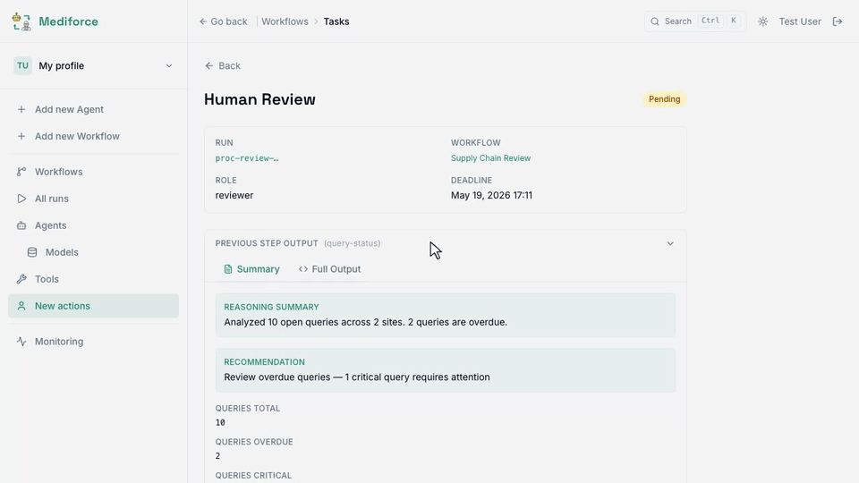

<div align="center">

# Mediforce

**The open-source platform for human-agent collaboration in pharma**

Define processes. Assign humans and AI agents to each step. Ship compliant workflows — fast.

[Why Mediforce](#why-mediforce) | [How It Works](#how-it-works) | [See It in Action](#see-it-in-action) | [Quick Start](#quick-start) | [Docs](#documentation)

</div>

---

## Why Mediforce

Pharma is ready for AI. The models are capable, the budgets exist, and the pressure to modernize is real. What's missing is the **infrastructure** — a way to deploy AI agents into regulated workflows with the compliance, auditability, and human oversight that GxP demands.

Mediforce is that infrastructure. Open-source, built for pharma, designed so your compliance team says yes on the first review.

- **One platform, every process.** Clinical operations, pharmacovigilance, supply chain — define a process once, configure autonomy per step, deploy. The first process is the hardest; every one after is incremental.
- **Your rules, your control.** An agent drafts and a human approves, or the agent acts and a human reviews after the fact. The process stays the same; the configuration adapts to your risk tolerance.
- **Compliance is not a bolt-on.** Audit trails, accountability, data integrity, and scoped access are built in from day one.

> **[Read the full vision](docs/concepts/vision.md)** — why this needs to exist and where we're headed.

## How It Works

Processes are made of steps. Each step is performed by a human, an AI agent, or both, under a Control Mode that fixes who decides what ([ADR-0014](docs/adr/0014-control-mode-ui-concept.md)):

| Mode | What it means |
|------|----------------|
| **No agent** `CM0` | Human, script, or automated action — no AI involved. |
| **Assist** `CM1` _(coming soon)_ | Human leads and does the work; AI reviews the result afterward. |
| **Cowork** `CM2` | Agent and human work together in real time, via chat or voice. |
| **Human review** `CM3` | Agent completes the step; a human approves before the workflow proceeds. |
| **Autonomous agent** `CM4` | Agent completes the step and the workflow advances; humans review after the fact via the audit trail. |

At any mode, an agent can signal uncertainty and escalate to a human. That isn't a failure mode — it's how the system stays safe in production.

Agents do real cognitive work inside these steps, not chat: reviewing consent forms and flagging missing fields, detecting anomalies across sites, drafting clinical summaries and safety narratives, forecasting supply demand, validating data integrity against standards. Every action lands in the audit trail.

## See It in Action

**Workflow dashboard** — every workflow in one place, with run counts and one-click access to any execution.

<div align="center">

</div>

**Human-in-the-loop review** — the core decision point. Reviewers see full context from the agent's work and submit their verdict: approve, revise, or escalate.

<div align="center">

</div>

## Quick Start

```bash
pnpm install
pnpm dev:mock        # port 9007, mocked agents, demo data seeded
```

Open `http://localhost:9007` and click through the UI — no cloud keys and no real agents; Docker is the one prerequisite, for the local Postgres. Full local stack, CLI, tests, and deployment: **[GETTING-STARTED.md](GETTING-STARTED.md)**.

## Why Open Source

In regulated industries, trust and transparency are non-negotiable:

- **Full transparency** — your compliance team can inspect every line of code
- **Zero vendor lock-in** — you own your deployment, your data, your customizations
- **Shared standard** — one AI integration layer built together, instead of one per company
- **Community-driven quality** — battle-tested by the people who use it

We're [Appsilon](https://appsilon.com) — we've been building open-source tools for life sciences for over a decade.

## Documentation

| | |
|---|---|
| **[Getting Started](GETTING-STARTED.md)** | Install, run the stack, ship your first workflow |
| **[Documentation index](docs/README.md)** | Every doc, what it's for, and how far to trust it |
| **[Vision](docs/concepts/vision.md)** | Why this needs to exist and where we're headed |
| **[Architecture](docs/concepts/architecture.md)** | Processes, steps, agents, compliance — the technical foundation |
| **[How We Work](docs/concepts/how-we-work.md)** | Building bottom-up, in public, with real processes |
| **[AGENTS.md](AGENTS.md)** | How we contribute with AI agents |

## Get Involved

- **[Join our Discord](https://discord.gg/TVx4VkG3C2)** — follow progress, ask questions, shape the roadmap
- **Star this repo** — helps others in pharma find us
- **Open an issue** — tell us what processes matter most to you

## License

Apache License 2.0 — see [LICENSE](LICENSE).

---

<div align="center">

*Built by [Appsilon](https://appsilon.com) — data solutions for life sciences since 2013.*

</div>
