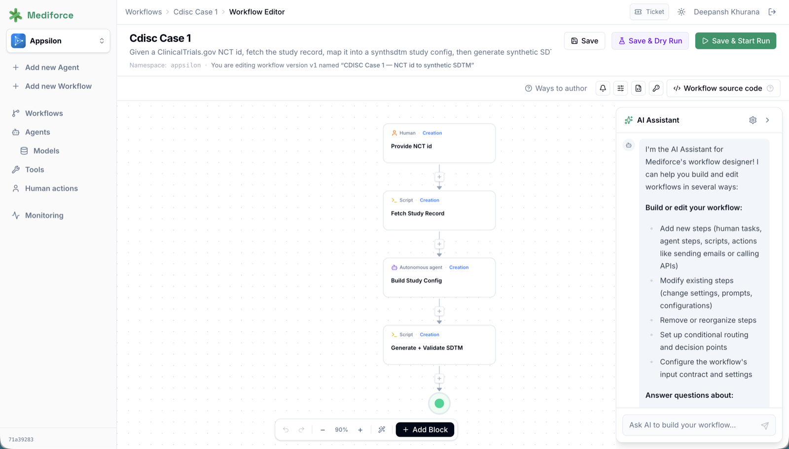

[](https://github.com/Appsilon/mediforce/actions/workflows/ci.yml)
[](https://github.com/Appsilon/mediforce/actions/workflows/docs.yml)
[](LICENSE)


[](https://mediforce.ai)


[mediforce.ai](https://mediforce.ai) | [Why Mediforce](#why-mediforce) | [How It Works](#how-it-works) | [See It in Action](#see-it-in-action) | [Quick Start](#quick-start) | [Docs](https://mediforce.ai/docs/)

## Why Mediforce

Pharma is ready for AI. The models are capable, the budgets exist, and the pressure to modernize is real. What's missing is the **infrastructure**: a way to deploy AI agents into regulated workflows with the compliance, auditability, and human oversight that GxP demands.

Mediforce is that infrastructure. Open-source, built for pharma, designed so your compliance team says yes on the first review.

- **One platform, every process:** Clinical operations, pharmacovigilance, supply chain. Define a process once, configure autonomy per step, deploy. The first process is the hardest; every one after is incremental.
- **Your rules, your control:** An agent drafts and a human approves, or the agent acts and a human reviews after the fact. The process stays the same; the configuration adapts to your risk tolerance.
- **Compliance is not a bolt-on:** Audit trails, accountability, data integrity, and scoped access are built in from day one.

## How It Works

Processes are made of steps. Each step is performed by a human, an AI agent, or both, under a Control Mode that fixes who decides what:

| Mode | What it means |
|------|----------------|
| **No agent** | Human, script, or automated action. No AI involved. |
| **Assist** _(coming soon)_ | Human leads and does the work; AI reviews the result afterward. |
| **Cowork** | Agent and human work together in real time, via chat or voice. |
| **Human review** | Agent completes the step; a human approves before the workflow proceeds. |
| **Autonomous agent** | Agent completes the step and the workflow advances; humans review after the fact via the audit trail. |

At any mode, an agent can signal uncertainty and escalate to a human. That isn't a failure mode, it's how the system stays safe in production.

Agents do real cognitive work inside these steps, not chat: reviewing consent forms and flagging missing fields, detecting anomalies across sites, drafting clinical summaries and safety narratives, forecasting supply demand, validating data integrity against standards. Every action lands in the audit trail.

## Build Workflows Easily



Author a workflow the way that suits the job. Describe it to the **AI Assistant** in plain language and it adds steps, wires the routing, sets prompts, and configures the input contract. Drag blocks onto the canvas yourself when you want precise control. Or paste and edit the definition directly as JSON in the source panel. All three edit the same workflow, so you can start with a sentence and finish by hand.

When it looks right, **Save & Dry Run** exercises the whole thing with mocked agents before a single real call is made.

## See It in Action

**Workflow dashboard:** Every workflow in one place, with run counts and one-click access to any execution.


**Human-in-the-loop review:** The core decision point. Reviewers see full context from the agent's work and submit their verdict: approve, revise, or escalate.


See what teams have built with it: **[Case Studies](https://mediforce.ai/case-studies/)**.

## Quick Start

```bash
pnpm install
pnpm dev:mock        # port 9007, mocked agents, demo data seeded
```

Open `http://localhost:9007` and click through the UI. No cloud keys and no real agents; Docker is the one prerequisite, for the local Postgres.

Full local stack, CLI, tests, and deployment: **[Install guide](https://mediforce.ai/docs/install/)**.

## Why Open Source

In regulated industries, trust and transparency are non-negotiable:

- **Full transparency:** Your compliance team can inspect every line of code.
- **Zero vendor lock-in:** You own your deployment, your data, your customizations.
- **Shared standard:** One AI integration layer built together, instead of one per company.
- **Community-driven quality:** Battle-tested by the people who use it.

## Documentation

Everything lives at **[mediforce.ai/docs](https://mediforce.ai/docs/)**: setup, architecture, workflow authoring, security, and worked examples.

## License

Apache License 2.0, see [LICENSE](LICENSE).
