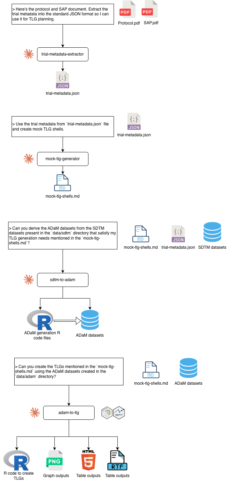

# Protocol to TFL

An AI-powered pipeline that transforms clinical trial protocol documents into production-ready Tables, Figures, and Listings (TFLs). Built as a set of Claude Code skills that chain together to automate the end-to-end clinical reporting workflow.



## Pipeline

The pipeline consists of 5 skills, each handling a discrete step:

| # | Skill | Input | Output |
|---|-------|-------|--------|
| 1 | **trial-metadata-extractor** | Protocol PDF, SAP PDF | `trial-metadata.json` |
| 2 | **mock-tlg-generator** | `trial-metadata.json` | `mock-tlg-shells.md` |
| 3 | **sdtm-to-adam** | TLG shells + SDTM datasets | ADaM datasets + R code |
| 4 | **adam-to-tlg** | ADaM datasets + TLG shells | Tables (HTML), Figures (PNG) |
| 5 | **adam-to-teal** | ADaM datasets | Interactive teal Shiny app |

## Stack

- **ADaM derivation**: R + [admiral](https://pharmaverse.github.io/admiral/)
- **Tables/Listings**: [gtsummary](https://www.danieldsjoberg.com/gtsummary/) + [gt](https://gt.rstudio.com/)
- **Figures**: [ggplot2](https://ggplot2.tidyverse.org/)
- **Statistics**: ANCOVA, MMRM, Fisher's exact, Kaplan-Meier (via mmrm, emmeans, survival, ggsurvfit)
- **Interactive exploration**: [teal](https://insightsengineering.github.io/teal/)

## Project Structure

```
plugins/protocol-to-tfl/skills/   # Skill definitions and reference docs
test-docs/                         # Trial protocol/SAP documents and SDTM data
outputs/                           # Generated ADaM datasets, TLGs, and teal apps
```

## Usage

Each skill is invoked via Claude Code with a natural language prompt. For example:

> Here's the protocol and SAP document. Extract the trial metadata into the standard JSON format so I can use it for TLG planning.

> Can you derive the ADaM datasets from the SDTM datasets present in the `data/sdtm` directory that satisfy my TLG generation needs mentioned in the `mock-tlg-shells.md`?

> Can you create the TLGs mentioned in the `mock-tlg-shells.md` using the ADaM datasets created in the `data/adam` directory?

See each skill's `SKILL.md` for detailed instructions and reference materials.
