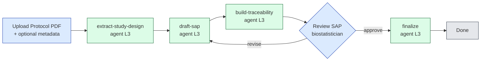

# CDISC AI Challenge — Use Case 2: AI-Driven SAP Generation

**Status:** initial workflow shipped (`apps/sap-generator`).
**Audience:** the Mediforce/Appsilon team and CDISC challenge reviewers.
**Purpose:** capture the problem, the solution, and why it answers the
challenge's evaluation criteria — so the analysis behind the implementation is
durable and shareable.

---

## 1. The problem

A **Statistical Analysis Plan (SAP)** is the pre-specified, regulatory-grade
document that defines exactly how a clinical trial's data will be analysed:
populations, endpoints, statistical methods, missing-data handling, multiplicity
control, and the planned tables/figures/listings (TLGs). It sits between the
**protocol** (what the trial does) and the **analysis** (ADaM datasets → TLGs →
the Clinical Study Report).

Today SAPs are **authored manually** by biostatisticians, typically over weeks,
reading the protocol and prior-study templates. That creates three problems the
CDISC challenge names directly:

| Pain | What it looks like in practice |
|---|---|
| **Inefficiency / delay** | Each SAP is re-written largely from scratch; weeks of senior-statistician time per study. |
| **Inconsistency** | Two studies of the same design get differently structured SAPs; house conventions drift; methods are described in prose that varies author to author. |
| **Weak traceability** | It is hard to prove, mechanically, that every planned analysis maps back to a study objective, an endpoint, and a population — and harder still to show which choices came from the protocol versus which the statistician introduced. |

> **Use Case 2 challenge statement:** *Demonstrate AI-enabled generation of SAP
> content that is accurate, consistent, and traceable to study design and
> analysis requirements.*

## 2. The CDISC concerns (and why traceability is the crux)

CDISC's broader push is **end-to-end traceability and automation** across the
analysis lifecycle. The relevant standard here is the **Analysis Results
Standard (ARS)** — a logical model that ties a planned **Analysis** to the
**AnalysisMethod** it uses, the **AnalysisSet** (population) and **DataSubset**
it runs on, the **GroupingFactor** it compares (e.g. treatment arm), and the
**Output/Display** it produces, all under one **ReportingEvent**. ARS exists so a
result can be traced back to its data selection, method, population, and the
plan that motivated it.

The implication for SAP generation: a tool that emits *only prose* cannot satisfy
"traceable to study design." A strong answer must emit **structured, linkable
metadata** alongside the prose, expressed in the vocabulary CDISC already uses.
That is the design centre of our solution.

## 3. The solution

`apps/sap-generator` is a Mediforce workflow that generates a SAP from a protocol
while making traceability a first-class, machine-checkable artifact. It runs as a
7-step human-in-the-loop pipeline of three Claude Code skills plus a
biostatistician review gate.



### The three skills and what they produce

| Step | Skill | Input | Output |
|---|---|---|---|
| 2 | **extract-study-design** | Protocol PDF (+ optional CRF / template / conventions) | `study-design.json` — objectives, endpoints, populations, design, treatment arms, visit schedule, sample size, and `analysis_requirements` |
| 3 | **draft-sap** | `study-design.json` | `sap-draft.md` — full SAP in the ICH E9 / industry layout |
| 4 | **build-traceability** | SAP draft + study design | `traceability-matrix.json` + `analysis-metadata.json` (CDISC ARS-aligned) |
| 6 | **finalize** (reuses *draft-sap*) | reviewer feedback | `sap-final.md` |

### Three design decisions that make it work

1. **A structured contract in the middle.** Generation is *not* "PDF → prose."
   It is "PDF → `study-design.json` → SAP." The intermediate JSON has an
   id-bearing spine — `objectives ↔ endpoints ↔ analysis_requirements ↔
   populations` — that everything downstream references. This is what makes the
   output **consistent** (same structure every study) and **traceable** (every
   analysis carries the ids it derives from).

2. **Honesty about what came from the protocol.** Protocols are higher-level than
   SAPs; many SAP choices (exact imputation method, multiplicity strategy) are
   not in the protocol. Rather than silently invent them, the extractor marks
   each such field with a `_sap_decision` flag, and the drafter surfaces it as a
   visible **`⚠️ SAP DECISION (not in protocol)`** note, collected in the SAP's
   "Changes from protocol" section. This is the **accuracy / fidelity** guarantee:
   a reviewer can see exactly what the AI added beyond the source.

3. **ARS-aligned traceability output.** `build-traceability` harvests the
   `[trace: …]` tags the drafter placed on every analysis, cross-checks them
   against `study-design.json`, and emits both a human-readable matrix and an
   `analysis-metadata.json` modeled on the CDISC ARS object subset (`Analysis →
   AnalysisMethod / AnalysisSet / GroupingFactor / Output`). It reports coverage
   (are all primary/secondary endpoints analysed?) and flags `dangling_trace`,
   `missing_analysis`, and `undocumented_decision` issues that send the SAP back
   for revision.

## 4. Why this addresses the CDISC criteria

| Criterion | How the solution delivers it |
|---|---|
| **Accurate** | Fidelity-over-completeness extraction (verbatim endpoint/population definitions, `null` + notes for gaps); the drafter never fabricates a method — protocol-silent choices become explicit, reviewable **SAP DECISION** flags. |
| **Consistent** | A single structured `study-design.json` contract and a fixed ICH E9 section template drive every SAP, so two studies of the same design yield comparably structured documents. The schema is shared with the downstream pipeline, so naming is stable across tools. |
| **Traceable to study design** | An id-bearing design spine + `[trace: …]` tags on every analysis + a **CDISC ARS-aligned** `analysis-metadata.json` give an auditable chain: objective → endpoint → analysis → method/population/grouping → display. Coverage and dangling-link checks are mechanical, not eyeballed. |
| **Human oversight (GxP)** | An L3 (drafter-with-review) autonomy model: the agent drafts, a **biostatistician** approves or sends back with feedback, and every step is captured in Mediforce's audit trail. |

## 5. How it fits Mediforce — and composes with `protocol-to-tfl`

The repo already ships [`apps/protocol-to-tfl`](../../protocol-to-tfl), which runs
the *downstream* half of the lifecycle: it consumes a protocol **and an existing
SAP**, extracts metadata, and generates mock TLGs → ADaM → TLGs.

`sap-generator` is the **upstream missing piece** — it produces the SAP that
`protocol-to-tfl` currently requires as a manual upload. The `study-design.json`
schema is intentionally **compatible** with `protocol-to-tfl`'s trial-metadata
contract, so the two apps chain into one continuous pipeline:

```
protocol ──▶ [sap-generator] ──▶ SAP + ARS metadata ──▶ [protocol-to-tfl] ──▶ ADaM ──▶ TLG ──▶ CSR
```

This is the strategic point for the challenge: we are not demonstrating an
isolated SAP toy, but a SAP-generation stage that slots into a real, end-to-end,
human-supervised clinical-reporting platform with built-in audit and autonomy
controls.

## 6. Artifacts produced by a run

| File | Written by | Role |
|---|---|---|
| `study-design.json` | extract-study-design | structured, id-bearing study design — the contract |
| `sap-draft.md` | draft-sap | the SAP document (ICH E9 layout, trace tags, SAP-decision flags) |
| `traceability-matrix.json` | build-traceability | objective→endpoint→analysis→section→display rows + coverage + issues |
| `analysis-metadata.json` | build-traceability | CDISC ARS-aligned analysis metadata |
| `sap-final.md` | finalize | reviewer-approved final SAP |

## 7. Scope, limitations, and next steps

**In scope now:** the registrable workflow, the three skills with reference
docs, and a schema/structure validation test (10/10 green). Markdown is the
primary SAP format.

**Known limitations / honest gaps:**
- The ARS output is a **pragmatic subset** of the normative ARS model — enough
  for traceability and downstream composition, not a full ARS export.
- SAP output is markdown; a polished DOCX assembly step is a follow-up (the
  `docx` skill exists in the repo).
- The skills have not yet been dry-run end-to-end against a real protocol on a
  live platform (see [running-locally.md](running-locally.md)); the validation so
  far is schema- and contract-level.

**Next steps:**
1. Dry-run the pipeline against an NSCLC protocol from
   `apps/protocol-to-tfl/data/test-docs/` and spot-check fidelity vs the source.
2. Validate the emitted `analysis-metadata.json` against the real ARS schema and
   widen the subset as needed.
3. Add the DOCX assembly step and a TLG-shell hand-off into `protocol-to-tfl`.

## 8. References

- CDISC AI Innovation Challenge 2026 — <https://www.cdisc.org/events/webinar/ai-innovation-challenge-2026-kickoff-webinar>
- CDISC Analysis Results Standard (ARS) — <https://www.cdisc.org/standards/foundational/analysis-results-standard>
- Getting Started with the CDISC ARS (PHUSE DS04, 2024) — <https://www.lexjansen.com/phuse-us/2024/ds/PAP_DS04.pdf>
- A template for the authoring of statistical analysis plans (PMC10300078) — <https://pmc.ncbi.nlm.nih.gov/articles/PMC10300078/>
- Internal: [`apps/sap-generator/README.md`](../README.md), the three `SKILL.md` files, and the [`protocol-to-tfl`](../../protocol-to-tfl) reference app.
