# Feature Gallery

Visual documentation of Mediforce features, auto-generated from E2E journey tests.

## Contents

**Authentication & Workspaces** — sign-in, workspace selection, and account setup
- [Sign In](#sign-in) — email/password sign-in with redirect to workspace
- [Workspace Selection](#workspace-selection) — choosing between personal and org workspaces
- [Forced Password Change](#forced-password-change) — invited user sets a permanent password on first sign-in

**Tasks** — human review queue for workflow steps requiring human input
- [Task Browsing & Grouping](#task-browsing--grouping) — reviewers find their tasks across workflows
- [Task Approve Flow](#task-approve-flow) — reviewer sees context, submits verdict

**Workflows** — defining and managing automated processes
- [Workflow Home](#workflow-home) — overview of all workflows and their active runs
- [Workflow Editor — Browse](#workflow-editor--browse) — navigating workflow definitions and versions
- [Workflow Editor — Canvas](#workflow-editor--canvas) — always-edit canvas with header controls and step panel
- [Workflow Editor — Add Step](#workflow-editor--add-step) — step type picker (Creation, Review, Decision) with executor selection
- [Workflow Editor — Undo](#workflow-editor--undo) — reverting canvas changes with the undo button
- [Workflow Editor — Redo](#workflow-editor--redo) — re-applying an undone change with the redo button
- [Workflow Editor — Hover Panel](#workflow-editor--hover-panel) — per-step delete and move actions revealed on hover
- [Workflow Editor — YAML](#workflow-editor--yaml) — live YAML preview in an always-on code editor
- [Workflow Editor — YAML Hidden](#workflow-editor--yaml-hidden) — YAML editor hidden while a step is selected
- [New Workflow](#new-workflow) — filling the creation form and publishing a workflow
- [New Workflow — Validation](#new-workflow--validation) — save blocked when workflow name is invalid
- [Workflow Editor — Pane Deselect](#workflow-editor--pane-deselect) — clicking canvas background deselects step and restores YAML panel
- [Workflow Editor — Executor Switch](#workflow-editor--executor-switch) — changing executor type clears stale fields from the workflow definition
- [Workflow Editor — Cowork Step](#workflow-editor--cowork-step) — adding a cowork step with human+agent collaboration config
- [Workflow Editor — Cowork MCP Servers](#workflow-editor--cowork-mcp-servers) — configuring MCP server tools on a cowork step
- [Workflow Editor — Step MCP Restrictions](#workflow-editor--step-mcp-restrictions) — per-step disable/denyTools overrides on top of the agent's MCP bindings

**Process Runs** — monitoring and controlling workflow executions
- [Run Detail — Step Graph](#run-detail--step-graph) — tracking progress through workflow steps
- [Run Detail — Completed](#run-detail--completed) — verifying all steps finished successfully
- [Run Detail — Autonomy Badges](#run-detail--autonomy-badges) — seeing which steps are agent-driven vs human
- [Cancel Run](#cancel-run) — safely stopping a running process with confirmation
- [Retry Failed Step](#retry-failed-step) — re-running a failed step in place without restarting the workflow
- [Workflow Status Badges](#workflow-status-badges) — semantic status display (In Progress, Waiting for human, Error, Completed)
- [Run Report](#run-report) — post-completion summary with timing and step outputs
- [Report Unavailable](#report-unavailable) — guard preventing report access on in-progress runs

**Co-work** — collaborative human+AI artifact building
- [Cowork Chat Session](#cowork-chat-session) — real-time conversation workspace with artifact panel
- [Cowork Finalize Flow](#cowork-finalize-flow) — locking the artifact and advancing the workflow

**Tools** — MCP server catalog with per-step access control
- [Tool Catalog](#tool-catalog) — browsing, searching, and inspecting MCP tools
- [Admin Tool Catalog](#admin-tool-catalog) — admins manage namespace-scoped stdio catalog entries (create, edit, delete)

**Agents** — AI agent catalog and execution oversight
- [Agent Catalog & History](#agent-catalog--history) — discovering agents and reviewing their past runs
- [Agent Escalated Run](#agent-escalated-run) — understanding why an agent flagged low confidence
- [New Agent Form](#new-agent-form) — creating a new agent definition
- [Agent MCP Bindings](#agent-mcp-bindings) — per-agent stdio (catalog) and HTTP (inline URL) tool bindings with allowlists
- [Agent OAuth Connection](#agent-oauth-connection) — per-agent OAuth flow against custom providers with Connect / Disconnect / Revoke

**Platform shortcuts** — keyboard-first utilities available everywhere
- [Command Palette — New Ticket](#command-palette--new-ticket) — file a bug/idea/question from the command palette
- [Command Palette — Shortcuts](#command-palette--shortcuts) — discoverable list of all keyboard shortcuts

---

## Authentication & Workspaces

### Sign In

Users sign in with their email and password. After successful authentication, the app redirects to workspace selection, which auto-routes to the personal workspace when there is only one workspace.

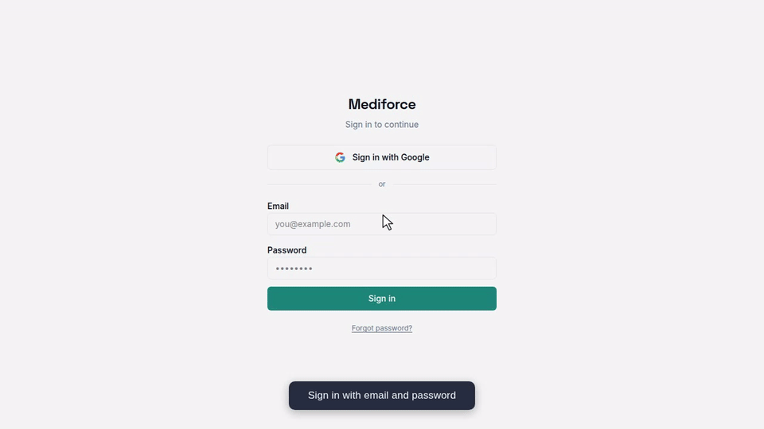

### Workspace Selection

Users with multiple workspaces (personal + org memberships) see a picker on sign-in. Each workspace is shown as a card. Selecting one navigates directly into that workspace. A "Set as default" checkbox lets users skip the picker on future sign-ins.

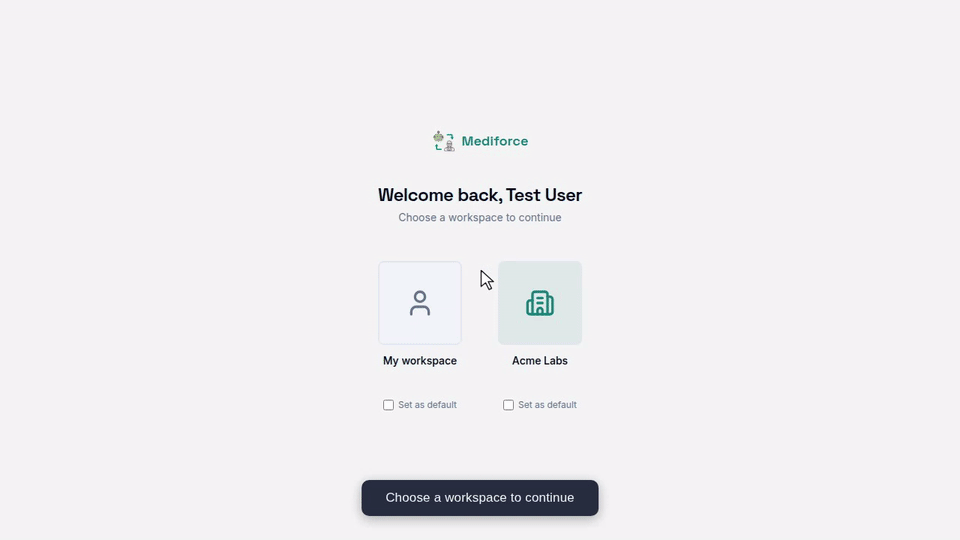

### Forced Password Change

When an admin invites a user and sets a temporary password, `mustChangePassword` is flagged in Firestore. On first sign-in the app intercepts the navigation and redirects to a mandatory password-change screen. The user sets a permanent password and is then routed into their workspace normally.

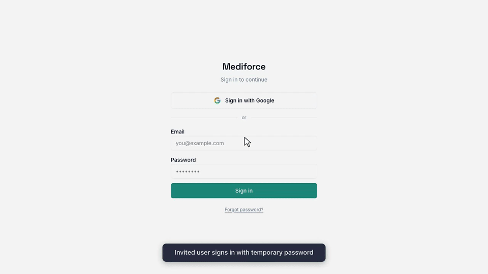

---

## Tasks

### Task Browsing & Grouping

Reviewers land here to see what needs their attention. Tasks from all workflows appear in one list. Display options let you group by workflow or action type so you can prioritize — e.g., see all "approve" tasks together vs all tasks for a specific workflow.

### Task Approve Flow

The core review screen. Reviewer sees the task context, previous step's output (what the agent produced), and the verdict buttons. This is the human-in-the-loop decision point.

---

## Workflows

### Workflow Home

The landing page after login. Shows all workflow definitions as cards with run counts and active/paused status. Users click into specific runs from here. Verifies that workflows are grouped correctly and navigation works.

### Workflow Editor — Browse

Workflow detail page with Runs tab (default) showing execution history, and Definitions tab showing version history. This is how you find which version of a workflow is running and access past definitions.

### Workflow Editor — Canvas

The definition version page always opens in edit mode — no separate "Edit" button needed. The sticky header shows the workflow name as a heading plus an editable description and version title. The "Save new version" button stays disabled until a version title is entered. Clicking any canvas node opens the "Edit step" panel on the right.

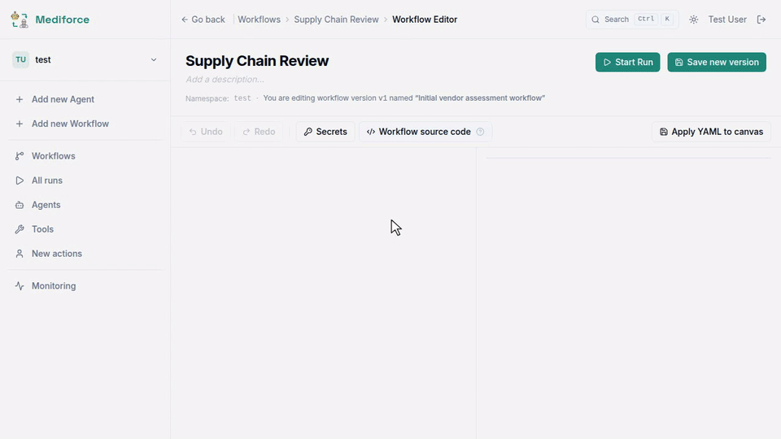

### Workflow Editor — Add Step

The "Add Step" dropdown presents step types (Creation, Review, Decision) each with a short description. Selecting a type reveals executor options ("Who handles this step?": human, agent, script, cowork). After choosing an executor the new step is inserted before the terminal node and auto-selected for editing.

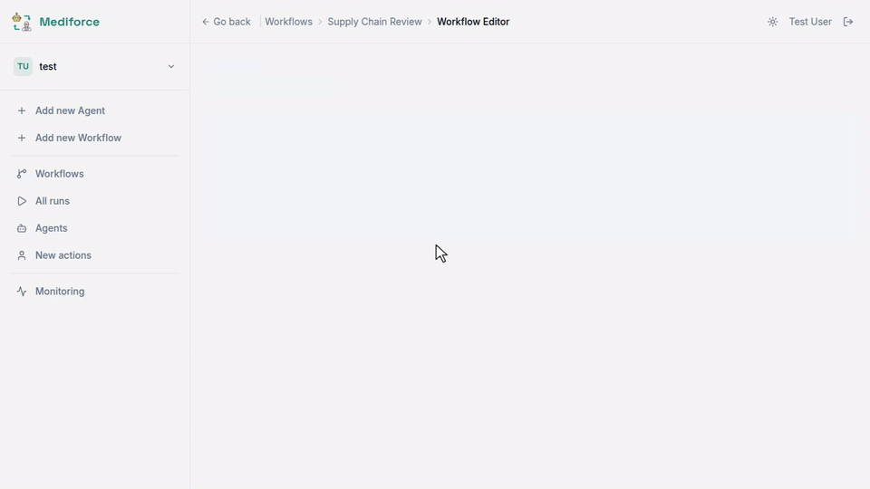

### Workflow Editor — Undo

The Undo button in the canvas toolbar reverses the last canvas change. It starts disabled (empty history), becomes enabled after any mutation (e.g. adding a step), and returns to disabled once the history is exhausted.

### Workflow Editor — Redo

The Redo button re-applies a change that was just undone. After undoing a step addition the Redo button becomes enabled; clicking it restores the step.

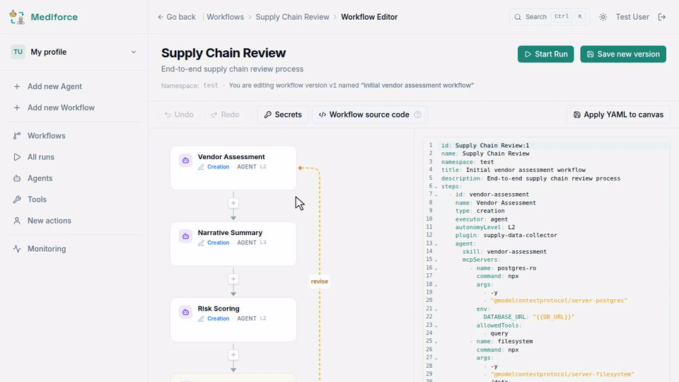

### Workflow Editor — Hover Panel

Each step node reveals a vertical panel of three icon buttons on hover: delete (red), move up, and move down. The move buttons are disabled for steps that can't swap without breaking branch/merge points. Clicking delete removes the step and re-wires transitions automatically.

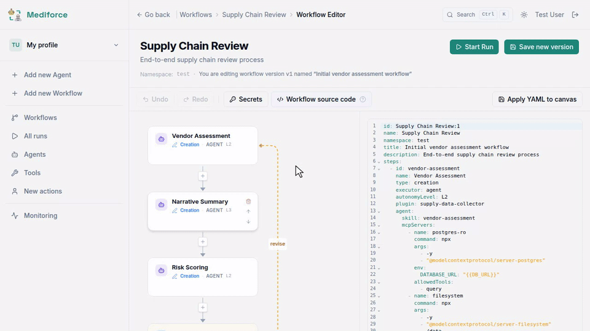

### Workflow Editor — YAML

When no step is selected the right panel shows a live CodeMirror editor with syntax-highlighted YAML for the full workflow definition. The "Save YAML" button in the toolbar applies edits made directly in the code editor.

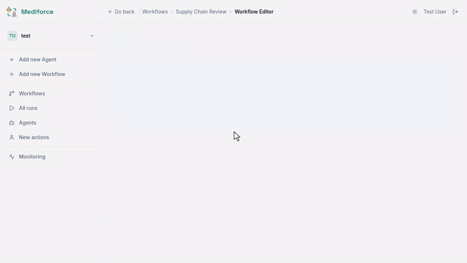

### Workflow Editor — YAML Hidden

Selecting a step replaces the YAML editor with the step configuration panel and hides both the "Workflow source code" label and the "Save YAML" button. Deselecting restores the YAML view.

### New Workflow

The new workflow form starts with a template canvas (draft → ai-review → done). The "Publish workflow" button stays disabled until all three fields are filled: workflow name, description, and version title. On save the user is redirected to the newly created definition page.

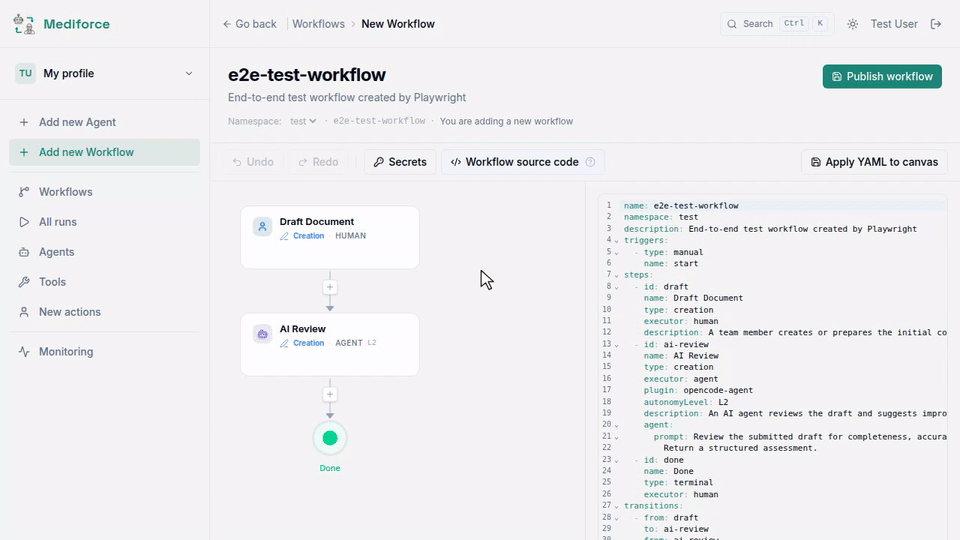

### New Workflow — Validation

If the workflow ID field contains only characters that slugify to an empty string (e.g. `---`), the save button remains disabled even when other required fields are filled. Guards against creating workflows with no valid URL-safe identifier.

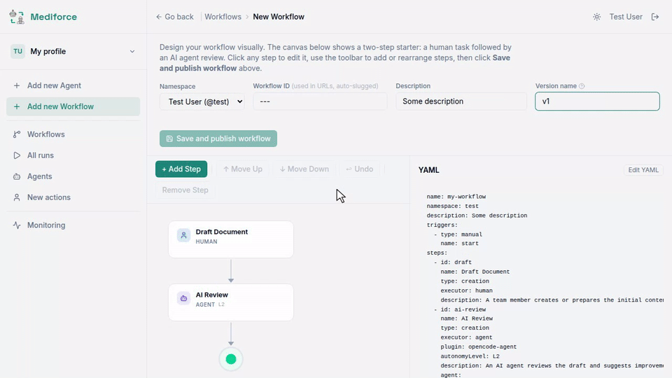

### Workflow Editor — Pane Deselect

Clicking the empty canvas background deselects the active step and restores the YAML preview panel on the right. This lets users quickly dismiss an open step editor without navigating away.

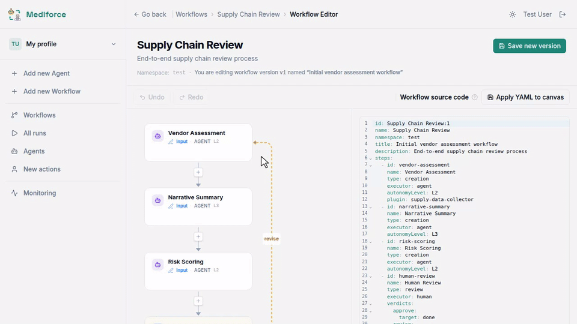

### Workflow Editor — Executor Switch

The step editor exposes a single 4-way toggle (Human / Agent / Script / Cowork) for all step types. Switching executor removes any fields that belong exclusively to the previous executor so the saved YAML stays consistent — no leftover `plugin`, `script`, or `cowork` blocks.

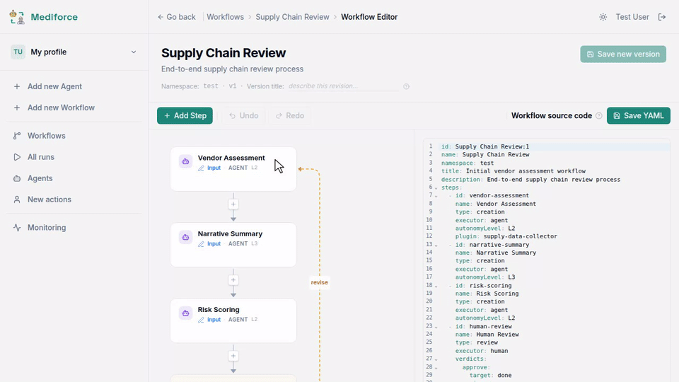

### Workflow Editor — Cowork Step

Adding a Cowork step opens an explainer for first-time users and a configuration panel: chat/voice toggle, foundation model selector, system prompt, and output schema. The step is rendered on the canvas with a teal "Cowork" badge.

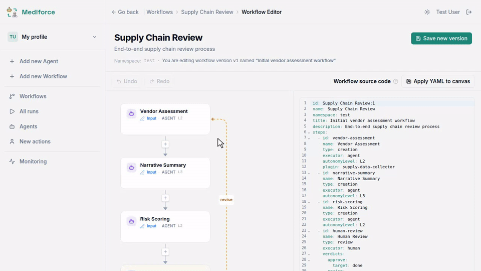

### Workflow Editor — Cowork MCP Servers

The cowork step editor includes an MCP Servers section where the agent's external tools are configured per step. Each entry toggles between stdio (command + args) and HTTP (URL) transports, accepts an optional allowedTools allowlist, and can be removed individually — returning the section to its empty-state hint.

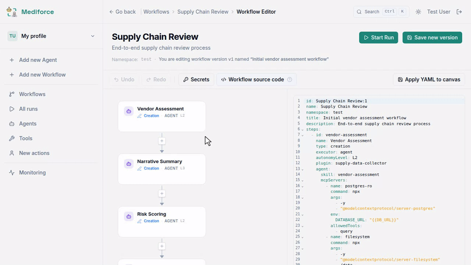

### Workflow Editor — Step MCP Restrictions

Agent steps show an MCP Restrictions panel listing every binding inherited from the step's agent definition (loaded live from `/api/agent-definitions/:id/mcp-servers`). For each binding the workflow author can toggle it off for this step or narrow its `allowedTools` via a deny list, and both overrides surface in the YAML under the step's `mcpRestrictions` block. This keeps agent-level bindings reusable while letting individual steps run with a tighter tool surface.

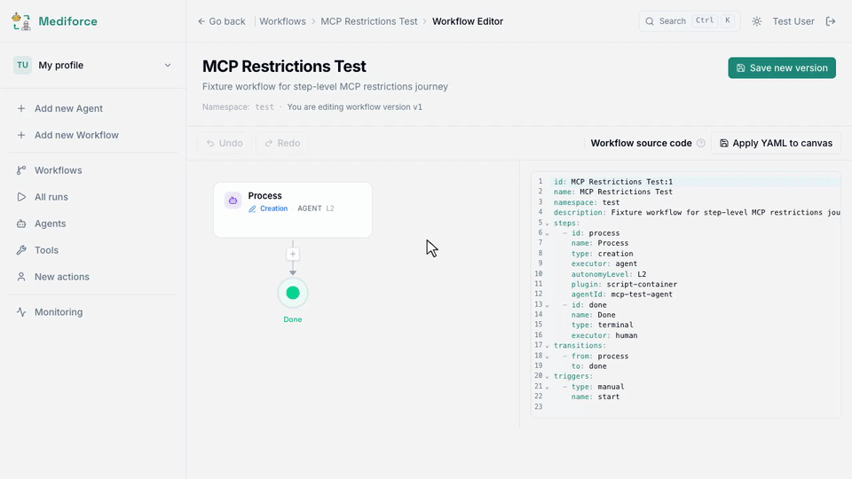

---

## Process Runs

### Run Detail — Step Graph

The main monitoring view for a running process. Step status panel shows all workflow steps with their current state (completed, running, pending). Verdict branches show which path a review step can take. Step History tab shows execution timeline with timestamps and executors.

### Run Detail — Completed

A fully completed process run. All steps show Completed status. Step history confirms each step executed successfully. This verifies the happy path renders correctly end-to-end.

### Run Detail — Autonomy Badges

Steps display their autonomy level (L1–L4) from the process config. L2 means agent acts + human approves, L4 means fully autonomous. Also verifies that new-style workflow runs (using workflowDefinitions instead of legacy processDefinitions) render the step panel correctly.

### Cancel Run

Stopping a running process requires double confirmation to prevent accidental cancellation. First click shows warning ("cannot be undone"), "Keep running" dismisses back to idle. Second attempt confirms and the run status changes.

### Retry Failed Step

When a step fails (docker daemon down, flaky network, etc.), clicking Retry on the failed step flips the instance back to running and the auto-runner re-dispatches that step — without restarting from the beginning. Variables from earlier steps are preserved.

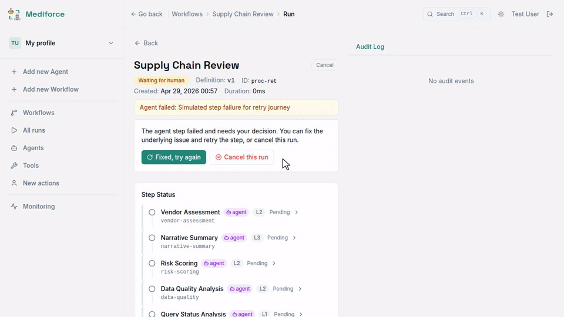

### Workflow Status Badges

Runs list and run detail show semantic status badges instead of raw `paused` state. Paused instances render as either "Waiting for human" (amber) or "Error" (red) depending on `pauseReason`, while active runs show "In Progress" (green) and finished runs show "Completed" (blue).

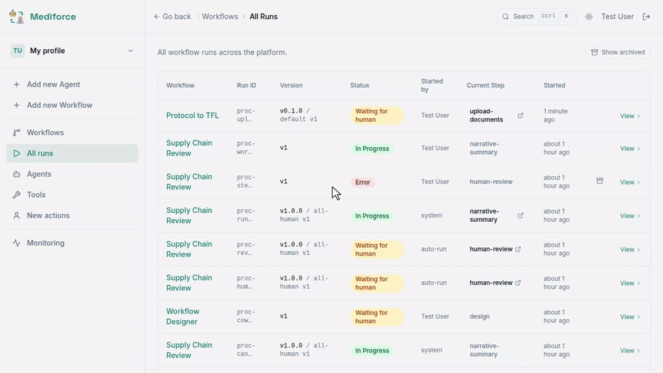

Error state with banner and "Run again this step" retry button:

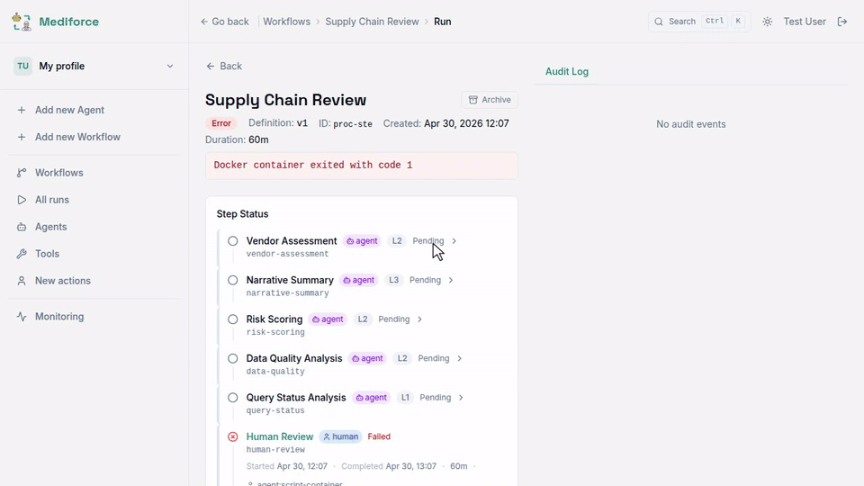

Waiting for human state with amber banner:

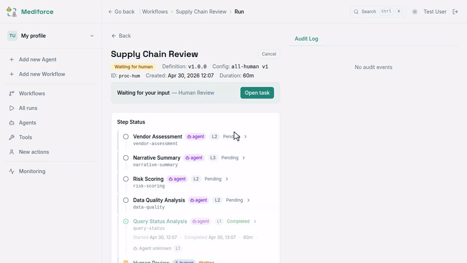

### Run Report

Post-completion report with step timeline, wall-clock and active processing times, and step outputs. Brief mode shows summary, Full mode shows complete output data. Used for audit trails and stakeholder reviews.

### Report Unavailable

Reports are only available for completed runs. Accessing the report URL for a running process shows a clear message instead of an error. Guards against broken links from in-progress runs.

---

## Co-work

### Cowork Chat Session

The cowork workspace where a human and AI agent collaborate to build an artifact. The left panel shows the conversation with step description context, and the right panel displays the artifact preview with a requirements checklist tracking which required fields have been fulfilled.

### Cowork Finalize Flow

When all required fields are present, the user clicks "Finalize Artifact" to lock the result and advance the workflow. The artifact badge changes from Draft to Finalized, the input is disabled, and a success banner confirms the workflow has moved to the next step with a "View run" link.

---

## Tools

### Tool Catalog

Organization-level MCP server catalog with three-layer access control. Browse tools by category (Development, Data Access, Clinical Data, etc.), search by name, and inspect tool details including connection info, required secrets, and per-tool allowlists. Each tool shows which operations are available vs restricted — workflow authors assign tools to specific steps, and agents only see tools explicitly granted to their step.

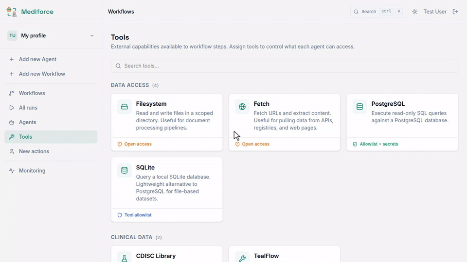

### Admin Tool Catalog

Admins manage the namespace-scoped MCP catalog from `/[handle]/admin/tool-catalog`. The split-pane layout lists all stdio entries on the left and edits the selected one on the right. A new-entry form collects `id`, `command`, variadic `args`, optional environment variables (with `{{SECRET:…}}` placeholders), and description. Editing updates the entry in place with an auto-save indicator; deleting pops a confirmation dialog and removes the entry from the namespace's `toolCatalog` subcollection.

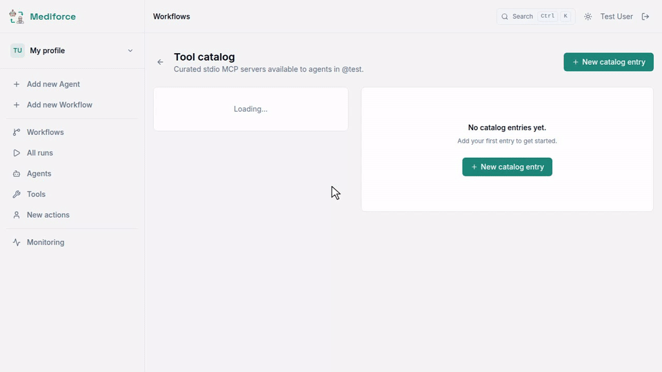

---

## Agents

### Agent Catalog & History

Browse available agent plugins (Risk Detection, Claude Code, etc.) with their input/output capabilities. Run History tab shows past executions with autonomy levels and status. Click through to individual run detail showing model used, confidence score, reasoning summary, and full output.

### Agent Escalated Run

When an agent reports low confidence (here 0.45), the run is escalated for human review. The rationale explains what caused uncertainty — e.g., "Multiple data inconsistencies in lab values". This is how reviewers understand why an agent couldn't make an autonomous decision.

### New Agent Form

Registration form for new agent definitions. Fill in name, select foundation model. This is the entry point for adding custom agents to the platform.

### Agent MCP Bindings

The agent detail page exposes an MCP Bindings section where authors attach tools to an agent. Stdio bindings pick a catalog entry and add an optional `allowedTools` allowlist; HTTP bindings take an inline URL plus optional allowlist — both are saved to the agent's `mcpBindings` array via `/api/agent-definitions/:id/mcp-servers/:name`. Deleting removes an individual binding, and a reload confirms HTTP bindings persist across sessions. Workflow steps consume these bindings as their baseline surface, which Step MCP Restrictions can further narrow.

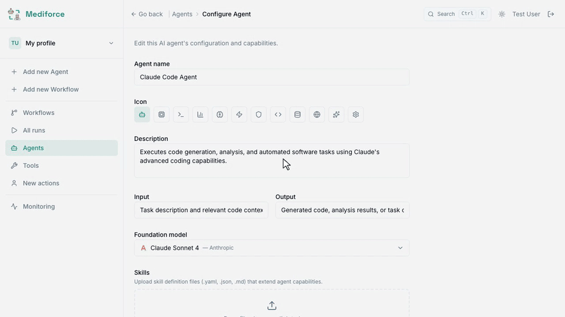

### Agent OAuth Connection

HTTP MCP bindings can authenticate against a namespace-scoped OAuth provider instead of static headers. The binding row exposes inline Connect / Disconnect / Revoke actions: Connect performs a full-page redirect through the provider's `authorize` → `/api/oauth/<provider>/callback` chain (state verified via stateless HMAC, no session storage), Disconnect removes the local token only, and Revoke additionally POSTs the provider's revoke endpoint. Tokens are auto-refreshed at spawn time when within 5 minutes of expiry. Providers (GitHub, Google, or custom OAuth2) are provisioned by admins under `/<handle>/admin/oauth-providers`.

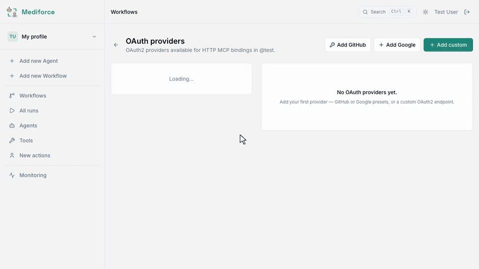

## Platform shortcuts

### Command Palette — New Ticket

Press `⌘K` (or `Ctrl+K`) from anywhere in the app to open the command palette. Select "New ticket" to file a bug, idea, or question as a GitHub issue in `appsilon/mediforce`. The form auto-attaches the current page and the filer's name as removable context chips, and switches the description template when you change the ticket type. On submit the palette closes and a toast links to the created issue.

### Command Palette — Shortcuts

Press `?` anywhere (outside text inputs) to open the keyboard shortcuts overlay. Sections populate automatically from the command registry — as new commands register shortcuts, they appear here without any extra wiring.

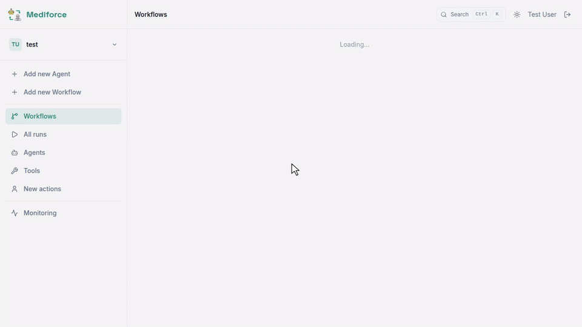
