# Feature Gallery

Visual documentation of Mediforce features, auto-generated from E2E journey tests.

## Contents

**Tasks** — human review queue for workflow steps requiring human input
- [Task Browsing & Grouping](#task-browsing--grouping) — reviewers find their tasks across workflows
- [Task Approve Flow](#task-approve-flow) — reviewer sees context, submits verdict

**Workflows** — defining and managing automated processes
- [Workflow Home](#workflow-home) — overview of all workflows and their active runs
- [Workflow Editor — Browse](#workflow-editor--browse) — navigating workflow definitions and versions
- [Workflow Editor — Edit Mode](#workflow-editor--edit-mode) — modifying workflow step graph visually

**Process Runs** — monitoring and controlling workflow executions
- [Run Detail — Step Graph](#run-detail--step-graph) — tracking progress through workflow steps
- [Run Detail — Completed](#run-detail--completed) — verifying all steps finished successfully
- [Run Detail — Autonomy Badges](#run-detail--autonomy-badges) — seeing which steps are agent-driven vs human
- [Cancel Run](#cancel-run) — safely stopping a running process with confirmation
- [Run Report](#run-report) — post-completion summary with timing and step outputs
- [Report Unavailable](#report-unavailable) — guard preventing report access on in-progress runs

**Co-work** — collaborative human+AI artifact building
- [Cowork Chat Session](#cowork-chat-session) — real-time conversation workspace with artifact panel
- [Cowork Finalize Flow](#cowork-finalize-flow) — locking the artifact and advancing the workflow

**Agents** — AI agent catalog and execution oversight
- [Agent Catalog & History](#agent-catalog--history) — discovering agents and reviewing their past runs
- [Agent Escalated Run](#agent-escalated-run) — understanding why an agent flagged low confidence
- [New Agent Form](#new-agent-form) — creating a new agent definition

---

## Tasks

### Task Browsing & Grouping

Reviewers land here to see what needs their attention. Tasks from all workflows appear in one list. Display options let you group by workflow or action type so you can prioritize — e.g., see all "approve" tasks together vs all tasks for a specific workflow.

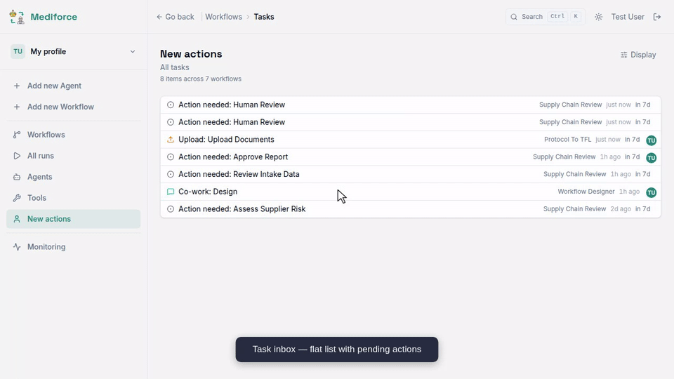

### Task Approve Flow

The core review screen. Reviewer sees the task context, previous step's output (what the agent produced), and the verdict buttons. This is the human-in-the-loop decision point.

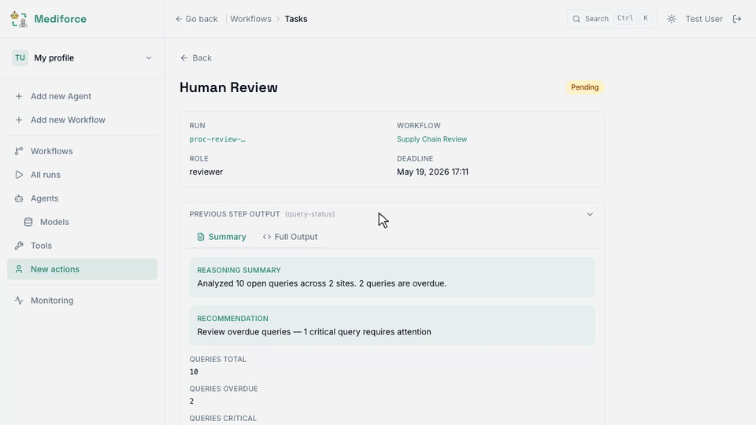

---

## Workflows

### Workflow Home

The landing page after login. Shows all workflow definitions as cards with run counts and active/paused status. Users click into specific runs from here. Verifies that workflows are grouped correctly and navigation works.

### Workflow Editor — Browse

Workflow detail page with Runs tab (default) showing execution history, and Definitions tab showing version history. This is how you find which version of a workflow is running and access past definitions.

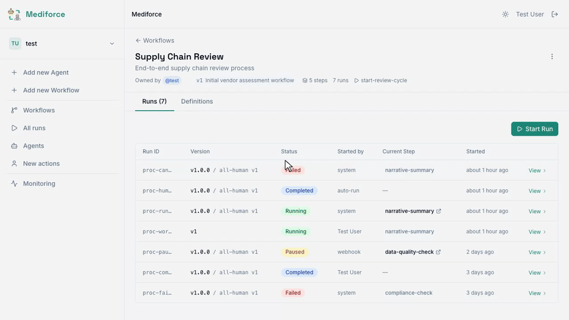

### Workflow Editor — Edit Mode

Visual editor for workflow definitions. Click nodes to inspect step configuration, enter edit mode to modify steps, use "+" to add new steps. Cancel discards without saving. This is how workflow authors iterate on process design.

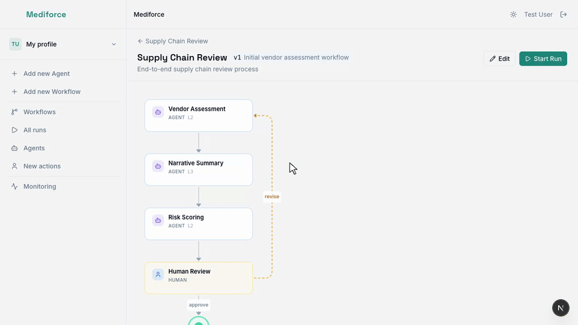

---

## Process Runs

### Run Detail — Step Graph

The main monitoring view for a running process. Step status panel shows all workflow steps with their current state (completed, running, pending). Verdict branches show which path a review step can take. Step History tab shows execution timeline with timestamps and executors.

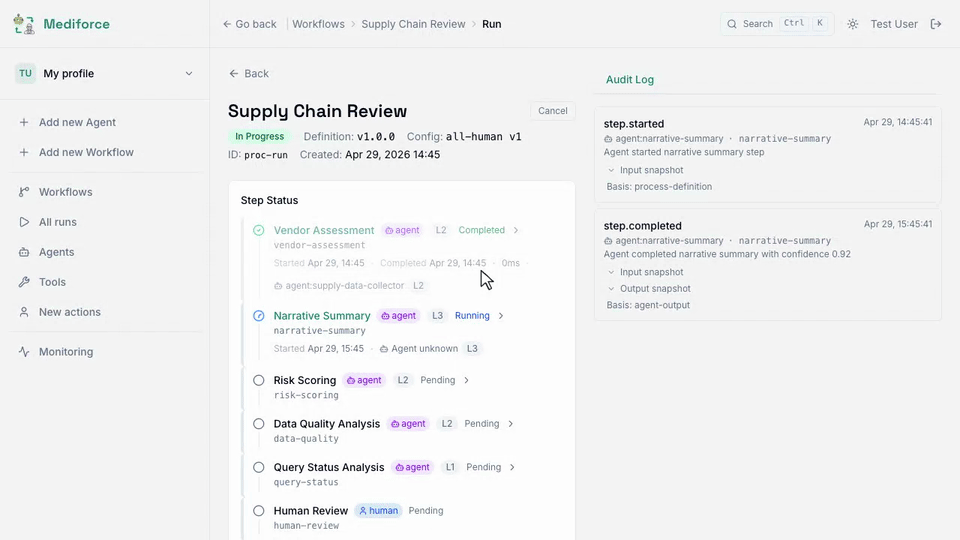

### Run Detail — Completed

A fully completed process run. All steps show Completed status. Step history confirms each step executed successfully. This verifies the happy path renders correctly end-to-end.

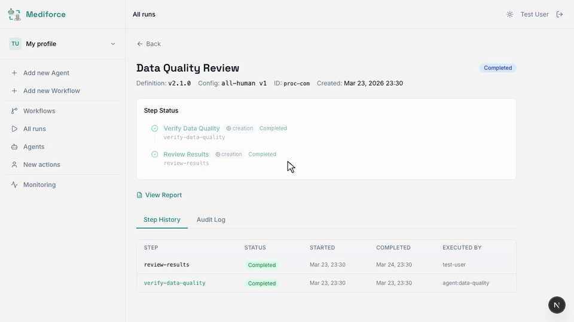

### Run Detail — Autonomy Badges

Steps display their autonomy level (L1–L4) from the process config. L2 means agent acts + human approves, L4 means fully autonomous. Also verifies that new-style workflow runs (using workflowDefinitions instead of legacy processDefinitions) render the step panel correctly.

### Cancel Run

Stopping a running process requires double confirmation to prevent accidental cancellation. First click shows warning ("cannot be undone"), "Keep running" dismisses back to idle. Second attempt confirms and the run status changes.

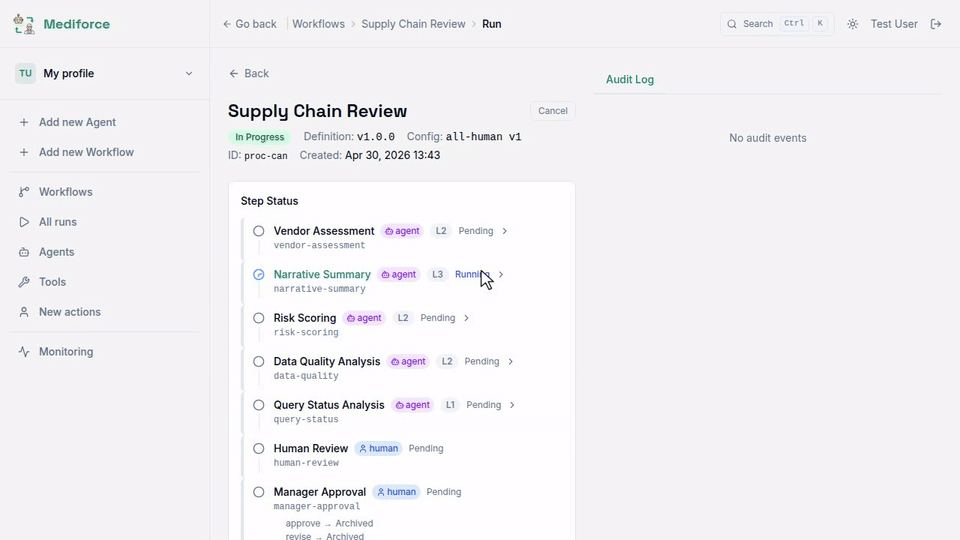

### Run Report

Post-completion report with step timeline, wall-clock and active processing times, and step outputs. Brief mode shows summary, Full mode shows complete output data. Used for audit trails and stakeholder reviews.

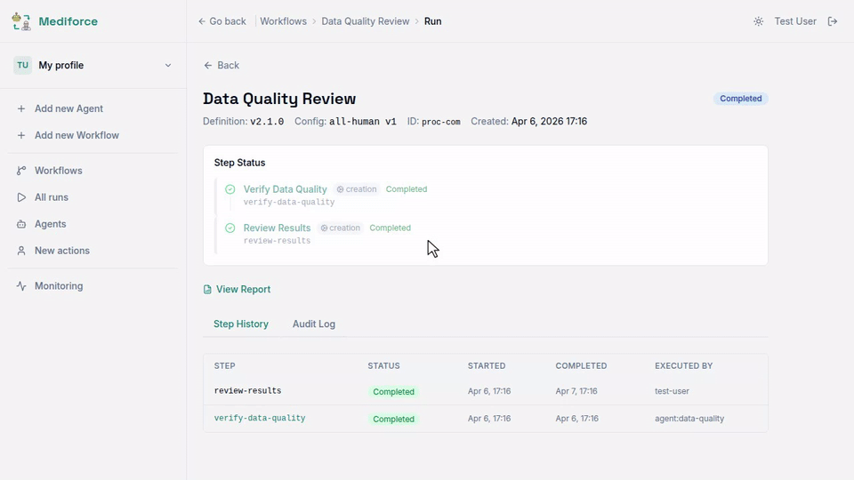

### Report Unavailable

Reports are only available for completed runs. Accessing the report URL for a running process shows a clear message instead of an error. Guards against broken links from in-progress runs.

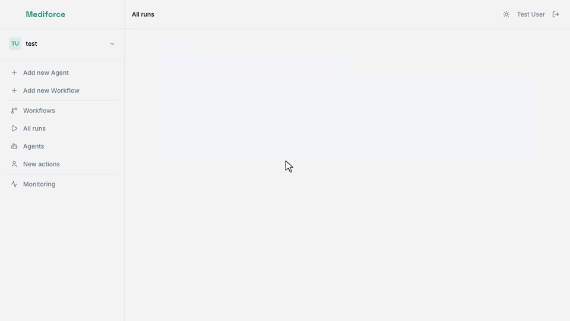

---

## Co-work

### Cowork Chat Session

The cowork workspace where a human and AI agent collaborate to build an artifact. The left panel shows the conversation with step description context, and the right panel displays the artifact preview with a requirements checklist tracking which required fields have been fulfilled.

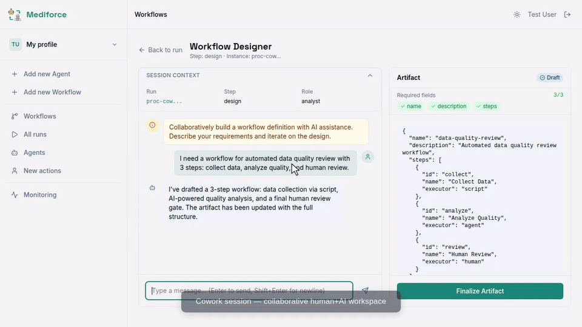

### Cowork Finalize Flow

When all required fields are present, the user clicks "Finalize Artifact" to lock the result and advance the workflow. The artifact badge changes from Draft to Finalized, the input is disabled, and a success banner confirms the workflow has moved to the next step with a "View run" link.

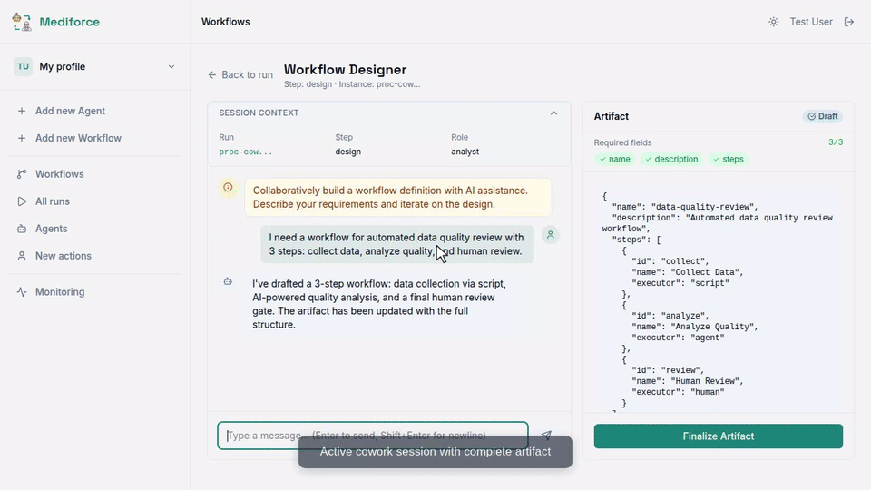

---

## Agents

### Agent Catalog & History

Browse available agent plugins (Risk Detection, Claude Code, etc.) with their input/output capabilities. Run History tab shows past executions with autonomy levels and status. Click through to individual run detail showing model used, confidence score, reasoning summary, and full output.

### Agent Escalated Run

When an agent reports low confidence (here 0.45), the run is escalated for human review. The rationale explains what caused uncertainty — e.g., "Multiple data inconsistencies in lab values". This is how reviewers understand why an agent couldn't make an autonomous decision.

### New Agent Form

Registration form for new agent definitions. Fill in name, select foundation model. This is the entry point for adding custom agents to the platform.

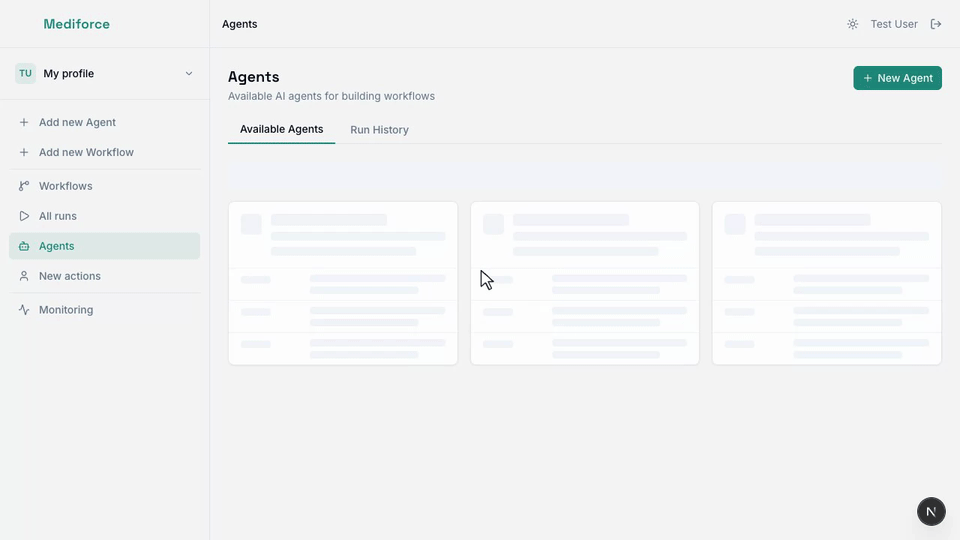
